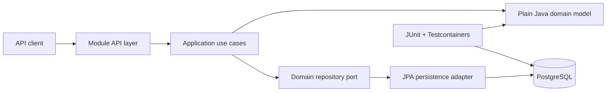

# LedgerOps

**A production-style, multi-tenant transaction-processing and financial-operations platform built with Java and Spring Boot.**

LedgerOps is a portfolio project about financial backend correctness: transactional consistency, double-entry accounting, idempotency, concurrency, tenant isolation, failure recovery, and evidence-driven architecture.

The project is being delivered incrementally as a modular monolith. Each capability is completed as a vertical slice with domain rules, PostgreSQL persistence, migrations, failure behaviour, tests, observability, and documentation.

> LedgerOps is a simulation and learning project. It does not process real money, store real card credentials, or claim regulatory certification.

## Why this project exists

LedgerOps demonstrates how a financial backend behaves when correctness matters:

- Can two concurrent retries create only one payment?
- Can a payment become completed only when its ledger posting succeeds?
- Can every financial posting be proven to balance?
- Can tenant-owned data remain isolated at every layer?
- Can ambiguous provider outcomes be recovered without inventing a false result?
- Can architectural claims be traced to executable tests and database constraints?

Every component must solve a documented business or failure problem. Technology choices follow those needs.

## Current status

**Active milestone:** Release 0.1 — Transactional Core

Selected verified foundations:

- Java 21 and Spring Boot application foundation
- explicit Spring Modulith module verification
- plain-Java `Tenant` domain model and lifecycle rules
- isolated `tenancy` PostgreSQL schema managed by Flyway
- explicit mapping between the domain model and JPA persistence model
- optimistic versioning and database constraints
- PostgreSQL integration tests using Testcontainers
- immutable Payment domain aggregate with the exact approved lifecycle and exhaustive transition tests
- tenant-wide Payment creation idempotency enforced by PostgreSQL, including coordinated concurrency and cross-merchant conflict tests
- validated Payment creation HTTP/OpenAPI contract with RFC 7807 failures and trace correlation
- Codex operating rules, implementation plans, ADR workflow, review checklist, and requirement traceability

ADR-016 reconciles the Payment lifecycle documentation. ADR-017 establishes the tenant-wide Payment API idempotency boundary. ADR-018 defines the minimal deterministic synchronous Risk model for Release 0.1. ADR-019 defines the Release 0.1 Ledger account model. The Payment domain, creation API, persistence, idempotency boundary, version-aware lifecycle persistence, and both Risk-orchestration transactions are implemented. The Risk rule/scoring domain, published API, V5 schema, JDBC persistence, rollback, and concurrency behavior are verified. Provider attempts, Ledger account persistence and posting, and atomic completion remain incomplete.

Slice 7 has started with the immutable balanced journal domain and invariant tests. The authoritative documents now define the ACTIVE-only Ledger account model, exact account-code catalog, tenant/code/currency uniqueness, immutable history, and posting validation. Account persistence remains pending review and has not started.

See the [Release 0.1 implementation plan](docs/plans/release-0.1-transactional-core.md) for the live sequence and current evidence.

## Architecture

LedgerOps starts as a Spring Boot modular monolith backed by one PostgreSQL database. Each module owns its schema and communicates through published interfaces instead of reading another module's tables.



Each module follows this dependency direction:

```text
api ───────────→ application ─→ domain
infrastructure ─→ application / domain ports
```

The domain layer does not depend on Spring Web, JPA, messaging, or infrastructure implementations. Spring Modulith and architecture tests will enforce module and dependency boundaries as the system grows.

## Financial correctness rules

These are release-blocking invariants, not optional design preferences:

1. A payment may become `COMPLETED` only when exactly one corresponding ledger transaction is posted in the same PostgreSQL transaction.
2. Every posted ledger transaction contains debit and credit entries and balances by currency.
3. Posted ledger entries are immutable; corrections use compensating transactions.
4. Duplicate requests must not create duplicate payments or financial effects.
   The Payment API namespace is tenant-wide: `tenantId + idempotencyKey` identifies one logical request. Reusing that pair with materially different content, including a different merchant, produces an explicit idempotency conflict.
5. PostgreSQL is the source of transactional truth.
6. Tenant context is mandatory for tenant-owned data.
7. Money uses `BigDecimal` with an explicit currency—never floating point.
8. Provider timeouts are ambiguous outcomes, not automatic failures.
9. Release 0.1 Risk evaluation uses only `PAYMENT_AMOUNT_THRESHOLD`, versioned tenant profiles, integer scores capped at 100, and the exact ADR-018 decision boundaries. Missing or invalid configuration cannot silently approve or reject a Payment.
10. Release 0.1 Ledger accounts are tenant-owned, use exactly `ACTIVE`, and are unique by `tenantId + accountCode + currency`. Posting rejects a missing, cross-tenant, currency-mismatched, or non-`ACTIVE` account atomically.

The [requirement traceability matrix](docs/requirements/TRACEABILITY.md) records how each implemented requirement is verified.

## Release roadmap

| Release | Outcome | Status |
|---|---|---|
| 0.1 | Transactional core: tenancy, payments, idempotency, synchronous risk, ledger, and atomic completion | In progress |
| 0.2 | Distributed processing with Kafka, transactional outbox, and idempotent consumers | Planned |
| 0.3 | Keycloak, identity, tenant membership, permissions, merchant scope, authorization, tenant isolation, reconciliation, corrections, and financial operations | Planned |
| 1.0 | Security hardening and release evidence: deployment controls, scanning, secrets, operational verification, documentation, observability, and portfolio release | Planned |
| Post-1.0 | Advisory applied-AI capabilities outside critical financial decisions | Deferred |

Later-release technology remains excluded until the approved release sequence introduces it.

## Technology

Current Release 0.1 stack:

- Java 21
- Spring Boot 4
- Spring Modulith
- Spring Data JPA
- PostgreSQL
- Flyway
- Gradle Kotlin DSL
- JUnit 5
- Testcontainers

The approved long-term technology baseline is documented in the [Technical Design and Architecture Specification](docs/architecture/LedgerOps_Technical_Design_and_Architecture_Specification_v1.4.docx), but technologies are introduced only in their approved release.

## Key repository paths

```text
.
├── src/main/java/com/ledgerops
│   └── tenancy
│       ├── domain
│       └── infrastructure
├── src/main/resources/db/migration
├── src/test/java/com/ledgerops
├── docs
│   ├── product
│   ├── architecture
│   ├── plans
│   ├── requirements
│   ├── adr
│   └── reviews
├── AGENTS.md
└── CONTRIBUTING.md
```

## Run the verified test suite

Prerequisites:

- Java 21
- Docker running locally

The Gradle wrapper downloads the approved Gradle version. Testcontainers starts a real PostgreSQL container automatically.

macOS or Linux:

```bash
./gradlew test
./gradlew check
```

Windows:

```powershell
.\gradlew.bat test
.\gradlew.bat check
```

The standalone local application runtime is not yet documented as complete. The repository currently provides a verified Testcontainers development path. A later vertical slice will add the reproducible local runtime when it is required.

## Engineering workflow

Every meaningful change should connect four kinds of evidence:

```text
Requirement → design decision → implementation → executable verification
```

- [Product Definition](docs/product/LedgerOps_Product_Definition_Official_v1.5.docx) — what the system must do
- [Technical Specification](docs/architecture/LedgerOps_Technical_Design_and_Architecture_Specification_v1.4.docx) — how the approved system is designed
- [Release 0.1 plan](docs/plans/release-0.1-transactional-core.md) — current implementation order and status
- [Requirement traceability](docs/requirements/TRACEABILITY.md) — requirements mapped to evidence
- [ADR process](docs/adr/README.md) — controlled architectural change
- [Code review checklist](docs/reviews/CODE_REVIEW_CHECKLIST.md) — correctness-first review standard
- [Contributing guide](CONTRIBUTING.md) — contribution and verification workflow

## What this repository demonstrates

- production-quality Java rather than framework-driven CRUD
- domain-driven design with explicit aggregates and value objects
- a modular monolith with enforceable ownership boundaries
- PostgreSQL constraints and transactions protecting critical invariants
- deterministic handling of idempotency and concurrency
- financial history that is balanced, immutable, and traceable
- tests that exercise real infrastructure and failure cases
- documentation that stays synchronized with implementation
- disciplined release sequencing without premature distribution

## Project principles

**Correctness before throughput. Modularity before distribution. Evidence over claims.**

LedgerOps is built in public-sized, reviewable increments so every architectural decision and financial guarantee can be understood, tested, and defended.
