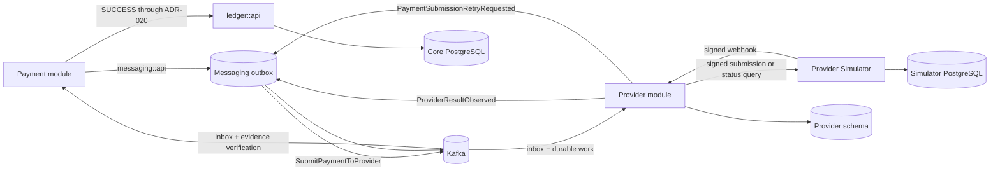
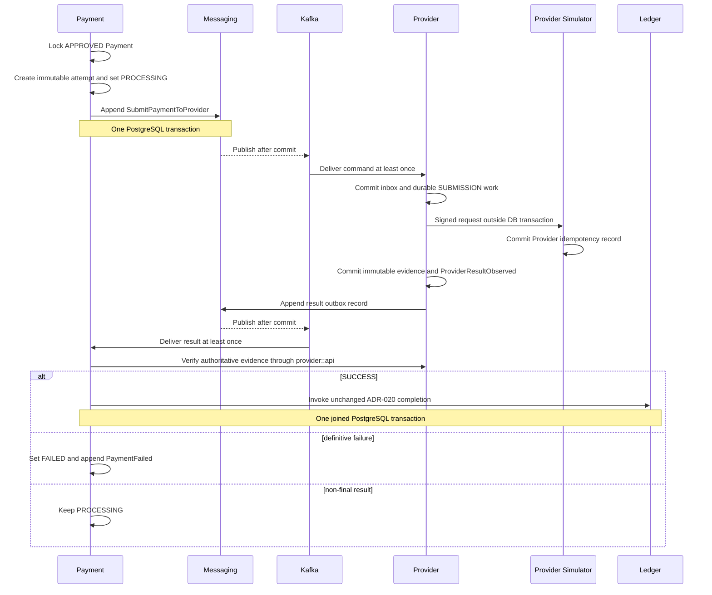
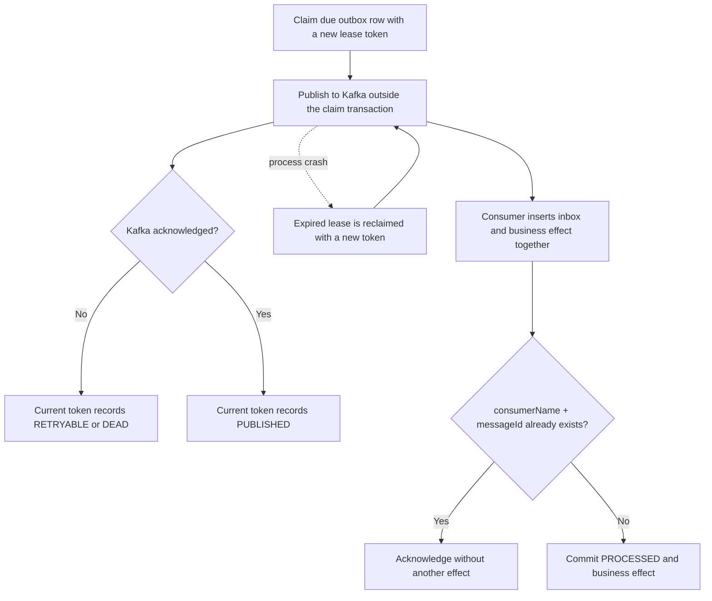
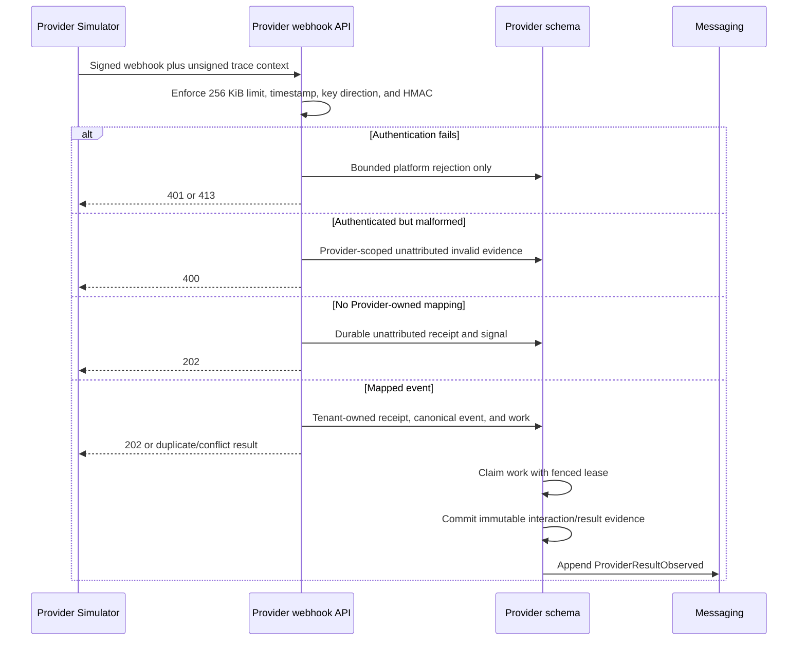
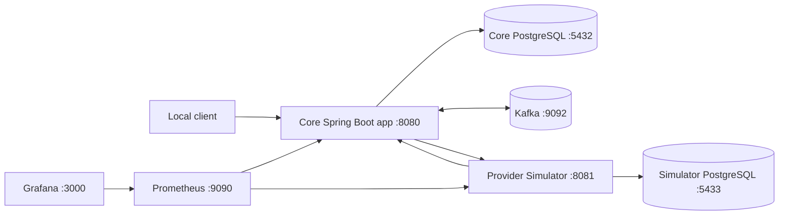

# Release 0.2 Provider flow

## Module ownership and dependency direction

Payment depends on `provider::api` and `messaging::api`; Provider depends only on
`messaging::api`. Provider never queries Payment data, and Payment never queries
Provider tables. The Provider Simulator is separately deployable and cannot access
the Core database.

Provider network calls occur outside database transactions. Business changes and
outbox intent commit in short PostgreSQL transactions. Kafka delivery is at least
once, so duplicate publication is expected. Inbox identity, business outbox
identity, Provider evidence identity, accepted-final-result evidence, and Ledger
source uniqueness reduce duplicates to one accepted business and financial effect.

`UNKNOWN`, `ACCEPTED`, and `PENDING` schedule status recovery without changing the
Payment from `PROCESSING`. A safe intentional retry creates a new immutable Payment
Attempt through `PaymentSubmissionRetryRequested`; it never repeats the original
submission work. Only definitive `SUCCESS` enters the unchanged ADR-020 completion
transaction.

## Initial submission and Provider result

The Payment submission transaction commits the lifecycle transition, immutable
attempt, and command intent together. The Provider call happens only after the
consumer has committed durable work. Stage A commits Provider evidence before
publication; Stage B verifies that evidence before applying any Payment result.

## Outbox and inbox crash windows

Kafka acknowledgement followed by a publisher crash can publish the same message
again. Fenced leases prevent stale database updates; inbox identity prevents the
duplicate delivery from repeating the business effect. The system does not claim
end-to-end exactly-once delivery.

## Webhook reception and asynchronous processing

Webhook payload fields never establish tenant identity. Provider resolves identity
from the mapping persisted when it consumed `SubmitPaymentToProvider`. Duplicate and
conflicting receipts remain evidence and never overwrite an accepted final result.

## Local deployment

Core and Provider Simulator run as separate applications and use different database
credentials. The Simulator has no route or credentials for the Core database.
Prometheus scrapes bounded application metrics, and Grafana loads separate messaging
and Provider-operations dashboards.
