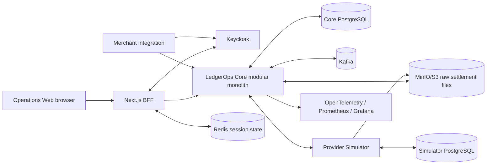

# Release 0.3 system context

Boundary rules:

- Keycloak authenticates; Core PostgreSQL authorizes.
- Redis stores ephemeral BFF sessions only.
- Provider Simulator never accesses Core PostgreSQL.
- Frontend never accesses databases or Kafka.
- PostgreSQL remains transactional/authorization truth; object storage holds immutable raw evidence.

Provider scenarios, product health, operational projections, notifications, and SSE follow ADR-027.
