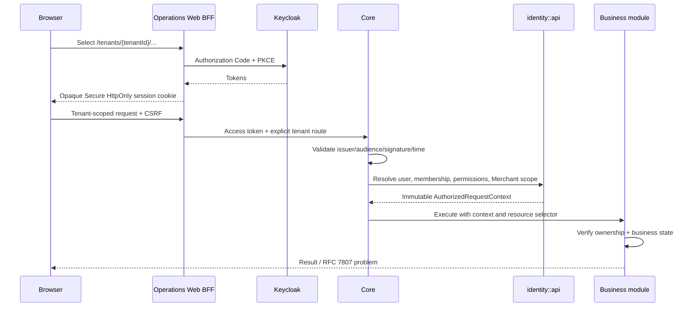

# Release 0.3 identity and request flow

The selected Tenant is an untrusted selector. Current PostgreSQL authorization and resource ownership determine authority. Redis/BFF session state never grants business permission.
