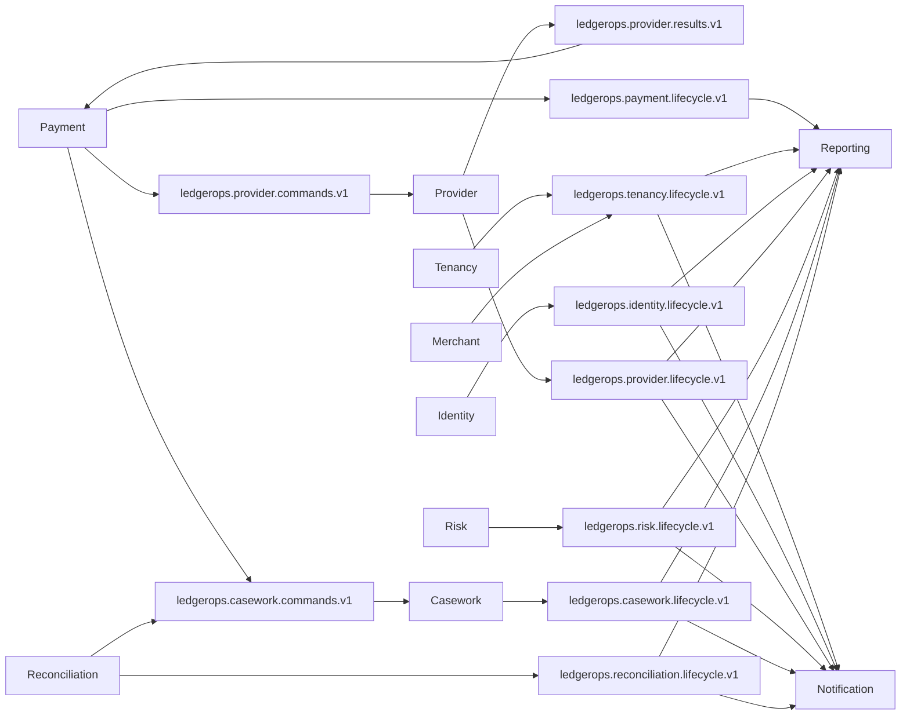

# Release 0.3 messaging topology

All publications use the transactional outbox. All consumers use inbox identity `consumerName + messageId`. ADR-025 defines exact producer/topic/dedup/partition/consumer names; ADR-027 defines Provider scenario/health and operational-projection semantics.
