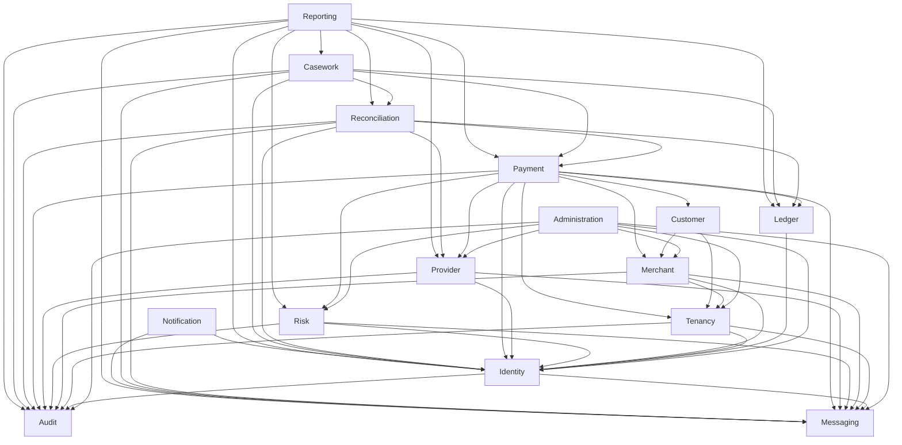

# Release 0.3 module dependency graph

Identity has no business-module dependency. Audit and Messaging have none. Administration owns cross-module Platform/Tenant administration and no duplicate business truth. Payment does not depend on Casework/Reconciliation; Reconciliation does not depend on Casework. Reporting uses read-only published APIs/events and never source tables or mutation APIs.
